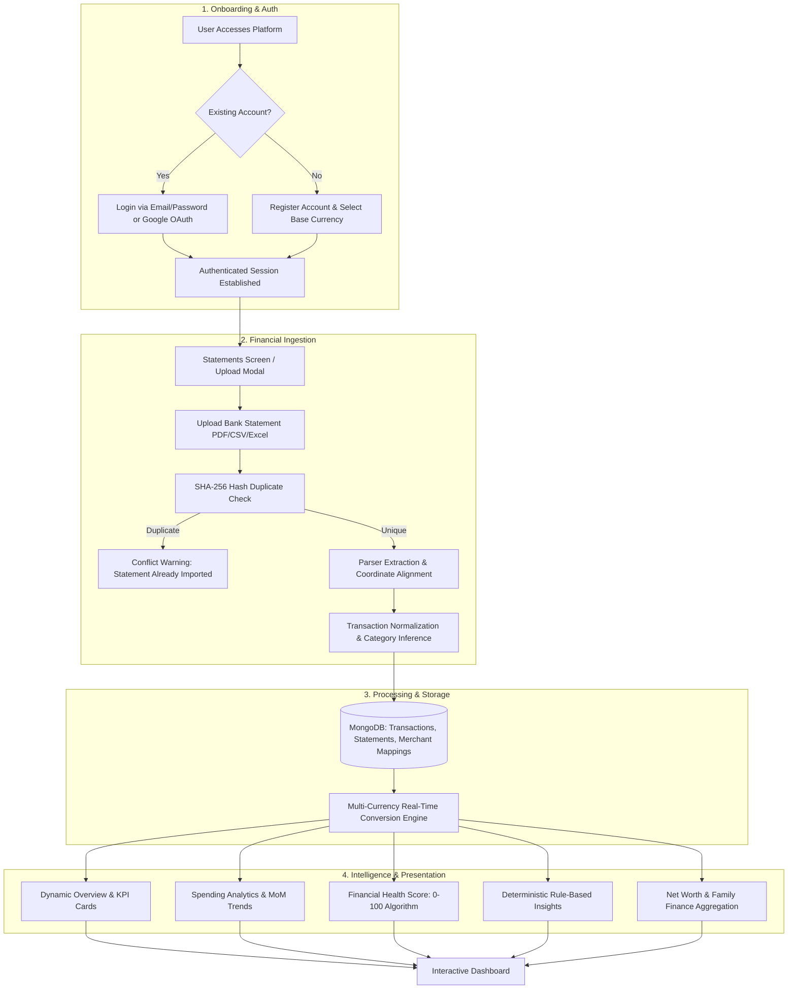
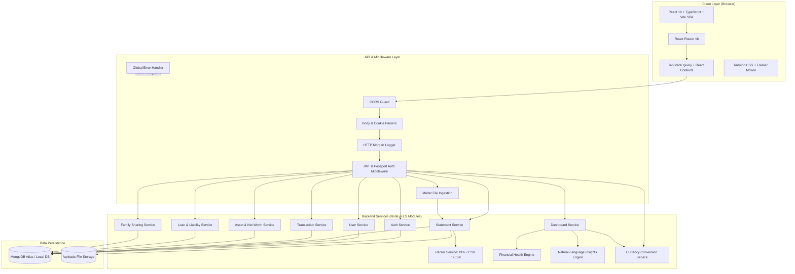
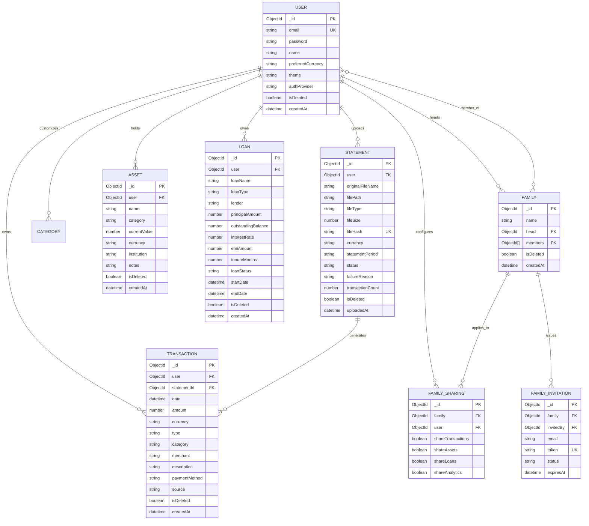
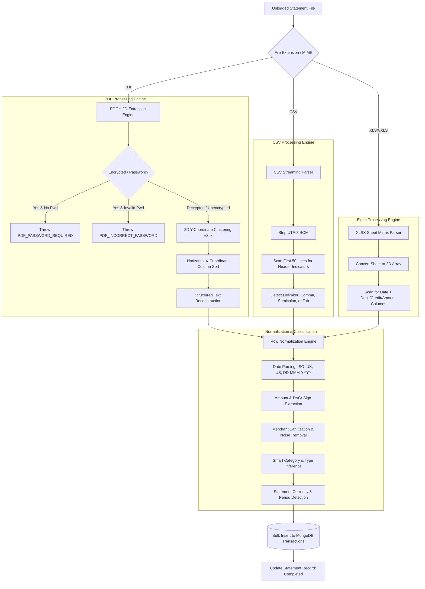

# FinanceOS

> **A Modern Full-Stack Financial Operating System for Personal & Family Wealth Intelligence**

[](https://nodejs.org/)
[](https://react.dev/)
[](https://www.typescriptlang.org/)
[](https://vitejs.dev/)
[](https://tailwindcss.com/)
[](https://www.mongodb.com/)
[](https://opensource.org/licenses/ISC)

---

## Table of Contents

- [1. Project Overview](#1-project-overview)
- [2. Core Features](#2-core-features)
- [3. Product Workflow](#3-product-workflow)
- [4. System Architecture](#4-system-architecture)
- [5. Detailed Architecture](#5-detailed-architecture)
  - [Frontend Architecture](#frontend-architecture)
  - [Backend Architecture](#backend-architecture)
  - [Database Architecture & Entity Relationships](#database-architecture--entity-relationships)
- [6. Data Flow](#6-data-flow)
- [7. Financial Intelligence Architecture](#7-financial-intelligence-architecture)
- [8. Technology Stack](#8-technology-stack)
- [9. Repository Structure](#9-repository-structure)
- [10. Frontend Deep Dive](#10-frontend-deep-dive)
- [11. Backend Deep Dive](#11-backend-deep-dive)
- [12. Authentication & Security](#12-authentication--security)
- [13. Financial Data Processing Pipeline](#13-financial-data-processing-pipeline)
- [14. API Overview](#14-api-overview)
- [15. Local Development Setup](#15-local-development-setup)
- [16. Development Workflow](#16-development-workflow)
- [17. Testing](#17-testing)
- [18. Deployment](#18-deployment)
- [19. Design Philosophy](#19-design-philosophy)
- [20. Architecture Decisions (ADRs)](#20-architecture-decisions-adrs)
- [21. Current Status](#21-current-status)
- [22. Roadmap](#22-roadmap)
- [23. Contributing](#23-contributing)
- [24. License](#24-license)
- [25. Project Vision](#25-project-vision)

---

## 1. Project Overview

**FinanceOS** is an intelligent, full-stack financial operating system designed to give individuals and families absolute clarity and control over their entire financial life.

### The Problem
Managing personal and family finances today is fragmented across disconnected banking portals, disparate investment accounts, loan statements, and manual spreadsheets. Existing personal finance trackers suffer from three major shortcomings:
1. **Fragile Ingestion**: Inability to seamlessly handle messy bank statements across formats (scanned/text PDFs, password-protected files, variable-delimiter CSVs, complex multi-sheet Excel files).
2. **Black-Box AI / Lack of Explainability**: Many modern tools present vague "AI advice" without showing exactly how figures were derived or separating actual observed facts from forward-looking estimates.
3. **Siloed Finances**: No native support for shared family finance, granular asset allocation, amortized liability tracking, and live multi-currency conversion in a single dashboard.

### The Solution
FinanceOS provides a unified platform that ingests raw financial documents, automatically parses and deduplicates records, infers categories and counterparties, and calculates real-time net worth, cash flow, debt burdens, and natural-language financial insights.

```text
Raw Statements (PDF / CSV / Excel) & Manual Inputs
                      ↓
  Cryptographic Deduplication & Coordinate-Aware Parser
                      ↓
  Transaction Normalization & Smart Category Inference
                      ↓
 Real-Time Aggregation & Multi-Currency Conversion Layer
                      ↓
 Explainable Intelligence Engine (Health Score + Insights)
                      ↓
   Interactive Web Application & Family Shared Vault
```

### Who It Is Designed For
* **Individuals**: Seeking automated tracking of spending habits, income sources, emergency fund health, and cash flow trends.
* **Multi-Currency Earners & Expats**: Users earning, spending, or holding assets in multiple currencies who need unified base-currency reporting.
* **Families & Couples**: Households that need a shared financial view for pooled expenses, assets, and liabilities while maintaining personal account privacy.
* **Developers & Evaluators**: Engineers looking for a clean, type-safe reference implementation of a modular Node.js/Express and React 19 financial application.

---

## 2. Core Features

### Implemented Features

| Feature Domain | Capabilities |
| :--- | :--- |
| **Authentication & Profile** | • Email/password registration and login with bcrypt hashing<br>• Google OAuth 2.0 single sign-on via Passport<br>• Dual-token JWT session management with HTTP-only cookies<br>• Password change, profile management, and account deletion |
| **Statement Ingestion Engine** | • Multi-format support: PDF (including password-protected), CSV, and Excel (`.xlsx`, `.xls`)<br>• Coordinate-aware 2D text extraction for multi-column PDF statements<br>• Automatic delimiter detection and header inference for CSV files<br>• SHA-256 cryptographic file hashing to prevent duplicate imports<br>• Asynchronous background processing pipeline with retry and error reporting |
| **Transaction Management** | • Complete CRUD operations for manual and imported transactions<br>• Multi-parameter filtering (date range, category, payment method, type: Income/Expense/Asset/Liability)<br>• Full-text search across merchants and narrations<br>• Soft-delete lifecycle with bulk statement deletion cascade |
| **Dynamic Dashboard** | • Real-time calculation of Monthly Income, Monthly Expenses, Net Balance, and Net Worth<br>• Dynamic period selection (Current Month, Last Month, 3 Months, 6 Months, 1 Year, Custom, All Time)<br>• Visual breakdown of top spending categories and latest transactions |
| **Spending Analytics** | • Month-over-Month (MoM) category spending comparisons with percentage variance<br>• 12-month historical income, expense, and savings trends using interactive Recharts<br>• Top merchant and top income source frequency analytics<br>• Highest individual expense and income transaction spotters |
| **Net Worth & Assets** | • Portfolio tracking across 9 asset categories: Cash, Bank Account, Gold, Real Estate, Vehicle, Stocks, Mutual Funds, Cryptocurrency, Others<br>• Real-time Net Worth computation: `(Manual Assets + Asset Transactions + All-Time Net Savings) - (Active Loans + Liability Transactions)` |
| **Loan & Liability Tracking** | • Amortized loan management across 7 loan types (Home, Car, Personal, Education, Business, Gold, Other)<br>• Tracking of principal, interest rates, tenure, EMI amounts, and outstanding balances<br>• Active vs Closed status management and EMI impact warnings |
| **Explainable Insights Engine** | • 100% deterministic rule-based natural language insights<br>• Savings rate progression, spending surges, category spikes (>20%), merchant frequency, loan-to-asset warnings, and high EMI burden alerts (>40%) |
| **Financial Health Score** | • 0–100 score computed across 4 pillars: Savings Rate (40 pts), Debt Ratio (30 pts), Spending Habits (20 pts), and Income Stability (10 pts)<br>• Transparent breakdown with categorical grading (*Excellent*, *Good*, *Fair*, *Needs Improvement*) |
| **Family Finance** | • Family workspace creation with role segregation: **Family Head** vs **Family Member**<br>• Secure tokenized email invitation workflow (Pending / Accepted / Rejected)<br>• Member management and granular sharing preference controls |
| **Multi-Currency System** | • Real-time and cached currency exchange rate engine supporting 10+ global currencies (USD, EUR, GBP, INR, JPY, CAD, AUD, CHF, NZD, CNY)<br>• Automatic transaction amount conversion to the user's preferred base currency |
| **Design & UI System** | • Responsive, accessible UI built with Tailwind CSS and Radix UI primitives<br>• Light, Dark, and System theme modes with emerald/purple accent palettes<br>• Micro-animations powered by Framer Motion and accessible skeleton loaders |

### Planned / Future Roadmap Features
* **Scanned OCR Ingestion**: Tesseract/Cloud OCR engine for photographed paper receipts and rasterized PDFs.
* **Recurring Bill & Subscription Detection**: Automated algorithmic detection of recurring subscriptions and bill forecasting.
* **Direct Bank Integrations**: Open Banking / Account Aggregator API integrations for real-time automated sync.
* **Native Mobile Applications**: React Native client for iOS and Android.
* **LLM Conversational Assistant**: Context-aware natural language assistant for querying financial history.

---

## 3. Product Workflow



---

## 4. System Architecture

FinanceOS is architected as a decoupled, modular system featuring a modern Single Page Application (SPA) frontend and a stateless RESTful backend backed by MongoDB.



---

## 5. Detailed Architecture

### Frontend Architecture
* **Framework**: React 19 with strict TypeScript typing.
* **Build System**: Vite 5 configured with manual chunk splitting (`react-vendor`, `ui-vendor`, `charts-vendor`, `form-vendor`, `query-vendor`).
* **Routing**: Centralized routing via `react-router-dom` v6 with route-level code splitting using `React.lazy` and `Suspense` fallbacks.
* **Server State**: `@tanstack/react-query` v5 for caching, automatic background re-fetching, and optimistic updates.
* **Client State**: Lightweight React Contexts (`AuthContext` for user session and `ThemeContext` for light/dark/system mode).
* **Form & Validation**: `react-hook-form` coupled with `zod` resolvers for strict runtime schema validation.
* **Styling & UI**: Tailwind CSS, `@radix-ui` primitives, and `lucide-react` icons.
* **Data Visualization**: `recharts` for responsive area, bar, and pie charts.

### Backend Architecture
* **Runtime**: Node.js (v18+) using native ECMAScript Modules (`"type": "module"`).
* **Framework**: Express.js 4.x structured using a Clean MVC / Layered Service pattern:
  * **Routes**: Pure endpoint routing with version prefix `/api/v1`.
  * **Middlewares**: Authentication verification, cookie extraction, multipart upload parsing, request validation, and global error handling.
  * **Controllers**: Request payload extraction, delegation to services, and standardized `ApiResponse` formatting.
  * **Services**: Isolated business logic, database queries, and parser execution. Never direct dependency on `req` or `res`.
  * **Models**: Mongoose schemas with compound indexes, soft-delete flags, and strict validation.
* **API Documentation**: Swagger UI integrated via `swagger-ui-express` and `swagger-jsdoc` at `/api/v1/docs` (non-production).

### Database Architecture & Entity Relationships



---

## 6. Data Flow

```text
1. Client HTTP Request (e.g. POST /api/v1/statements/upload)
   ├── Carries Multipart FormData (File) + Auth Header / Cookie
   ▼
2. Middleware Ingestion
   ├── CORS Validation (Netlify / localhost origins)
   ├── Auth Middleware: Decodes JWT Access Token & verifies User
   ├── Multer Middleware: Validates MIME type (PDF/CSV/XLSX) & writes to /uploads
   ▼
3. Statement Service
   ├── Computes SHA-256 hash of file buffer
   ├── Enforces duplicate prevention check
   ├── Saves initial Statement record (Status: "Uploaded")
   ▼
4. Parser Service
   ├── PDF: Coordinate-clustering extraction (horizontal line sorting via Y-axis ±3px)
   ├── CSV: Header & delimiter auto-discovery, BOM stripping
   ├── XLSX: Sheet matrix scanning & Debit/Credit column detection
   ├── Normalizes dates, signs, currencies, and extracts clean merchant strings
   ▼
5. Transaction Persistence
   ├── Bulk writes normalized rows to Transaction collection with statementId
   ├── Updates Statement record (Status: "Completed", transactionCount: N)
   ▼
6. Query-Time Aggregation & Intelligence Layer
   ├── Converts amounts to user preferred base currency (cached exchange rates)
   ├── Sums Income, Expenses, Assets, Liabilities, and Net Worth
   ├── Runs pure-function rules in Insights Engine & calculates Health Score (0-100)
   ▼
7. Standardized Response Serialization
   ├── Returns ApiResponse (Status: 200/201, Data, Message)
   ▼
8. Client State & Reactive UI Render
   ├── TanStack Query invalidates affected query keys
   ├── Recharts & KPI components render updated graphs with smooth micro-animations
```

---

## 7. Financial Intelligence Architecture

A core design principle of FinanceOS is **deterministic explainability**. Financial applications must never invent figures or present ungrounded AI summaries. FinanceOS strictly separates data into three distinct tiers:

```
┌─────────────────────────────────────────────────────────────┐
│                      1. OBSERVED DATA                       │
│    (Immutable facts parsed directly from bank statements)   │
│  • Transaction Dates  • Raw Narration  • Amounts  • Dr/Cr   │
└──────────────────────────────┬──────────────────────────────┘
                               │
                               ▼
┌─────────────────────────────────────────────────────────────┐
│                   2. CALCULATED INSIGHTS                    │
│      (Deterministic mathematical formulas computed on fly)  │
│  • Monthly Cash Flow  • Net Worth  • MoM % Category Shifts  │
│  • Financial Health Score (40+30+20+10 = 100 pt Scale)      │
└──────────────────────────────┬──────────────────────────────┘
                               │
                               ▼
┌─────────────────────────────────────────────────────────────┐
│                   3. PREDICTIVE HEURISTICS                  │
│       (Clear, explainable warnings and financial alerts)     │
│  • High EMI Burden (>40%)  • High Debt-to-Asset Ratio (>50%)│
│  • Category Outlier Spikes (>20% Increase vs Prior Month)   │
└─────────────────────────────────────────────────────────────┘
```

### Financial Health Score Algorithm
The platform evaluates financial health on a **0 to 100 point scale** based on four transparent pillars:

| Pillar | Max Weight | Logic & Scoring Thresholds |
| :--- | :---: | :--- |
| **Savings Rate** | **40 pts** | Evaluates current month savings as a percentage of income.<br>• Full 40 pts awarded for $\ge 20\%$ savings rate.<br>• Scaled linearly below $20\%$: $\text{Score} = \text{SavingsRate} \times 200$. |
| **Debt Ratio** | **30 pts** | Evaluates total liabilities against total assets.<br>• Full 30 pts awarded when liabilities $= 0$.<br>• Scaled linearly down to 0 pts when liabilities $\ge$ assets: $\text{Score} = 30 - (\text{DebtRatio} \times 30)$. |
| **Spending Habits** | **20 pts** | Evaluates month-over-month expenditure stability.<br>• Full 20 pts awarded if expenses did not increase.<br>• Penalized linearly up to a $50\%$ spending surge: $\text{Score} = 20 - (\text{IncreaseRatio} \times 40)$. |
| **Income Stability** | **10 pts** | Evaluates consistent income streams.<br>• Full 10 pts when income is recorded in both current and previous months.<br>• 5 pts if income recorded only in current month; 0 pts if none. |

**Score Categorization**:
* **90 – 100**: *Excellent*
* **75 – 89**: *Good*
* **60 – 74**: *Fair*
* **0 – 59**: *Needs Improvement*

### Natural-Language Rules Engine
The insights engine (`backend/src/utils/insights.engine.js`) evaluates an ordered suite of pure rule functions:
1. `savingsTrendRule`: Identifies percentage improvement or decline in net savings.
2. `expenseTrendRule`: Flags percentage rise or reduction in total spending.
3. `topCategoryRule`: Identifies the dominant expense category and nominal amount.
4. `categorySpikeRule`: Triggers an alert when any category increases by $>20\%$ compared to the preceding month.
5. `frequentMerchantRule`: Identifies the most frequently visited merchant by transaction frequency.
6. `largestExpenseRule`: Isolates the single highest expense transaction and counterparty.
7. `loanToAssetRule`: Flags when total loan liabilities exceed $25\%$ (caution) or $50\%$ (critical) of total assets.
8. `emiBurdenRule`: Warns when monthly loan EMIs consume $>25\%$ (caution) or $>40\%$ (critical) of monthly income.
9. `positiveBalanceRule`: Celebrates positive savings milestones.
10. `noIncomeRule`: Prompts the user to log income data if zero income is recorded.

---

## 8. Technology Stack

| Layer | Technology | Version | Purpose |
| :--- | :--- | :--- | :--- |
| **Frontend Framework** | [React](https://react.dev/) | `^19.0.0` | Declarative UI rendering & state orchestration |
| **Language (Frontend)** | [TypeScript](https://www.typescriptlang.org/) | `^5.6.3` | Type safety, interface definitions, refactor resilience |
| **Build & Bundler** | [Vite](https://vitejs.dev/) | `^5.4.3` | Ultra-fast HMR and optimized production bundling |
| **Client Routing** | [React Router](https://reactrouter.com/) | `^6.28.0` | Client-side routing, protected routes, layout nesting |
| **Server State Cache** | [TanStack Query](https://tanstack.com/query) | `^5.50.1` | Asynchronous query caching, synchronization, optimistic UI |
| **Styling & Design System** | [Tailwind CSS](https://tailwindcss.com/) | `^3.4.19` | Utility-first responsive CSS styling with dark/light themes |
| **UI Primitives** | [Radix UI](https://www.radix-ui.com/) | `^1.1.x / ^2.x` | Accessible headless dialogs, dropdowns, popovers, select |
| **Animations** | [Framer Motion](https://www.framer.com/motion/) | `^11.3.24` | Page transitions, spring micro-interactions, modal animations |
| **Form Handling** | [React Hook Form](https://react-hook-form.com/) | `^7.52.1` | Performant form state management without re-renders |
| **Schema Validation** | [Zod](https://zod.dev/) | `^3.23.8` | Declarative schema validation for forms & API payloads |
| **Icons** | [Lucide React](https://lucide.dev/) | `^0.408.0` | Comprehensive lightweight SVG icon system |
| **Charts & Visualizations** | [Recharts](https://recharts.org/) | `^2.12.10` | Responsive Area, Bar, and Pie financial charts |
| **Backend Runtime** | [Node.js](https://nodejs.org/) | `>=18.0.0` | Asynchronous JavaScript runtime (ES Modules) |
| **Backend Framework** | [Express.js](https://expressjs.com/) | `^4.22.2` | RESTful API routing, middleware execution pipeline |
| **Database & ODM** | [MongoDB](https://www.mongodb.com/) / [Mongoose](https://mongoosejs.com/) | `^7.8.11` | Document database with schema modeling, indexes, aggregates |
| **Authentication** | [jsonwebtoken](https://github.com/auth0/node-jsonwebtoken) & [bcrypt](https://github.com/kelektiv/node.bcrypt.js) | `^9.0.3` / `^6.0.0` | JWT dual-token generation, password hashing & comparison |
| **OAuth Integration** | [Passport.js](http://www.passportjs.org/) | `^0.7.0` | Google OAuth 2.0 social login (`passport-google-oauth20`) |
| **File Ingestion** | [Multer](https://github.com/expressjs/multer) | `^1.4.4` | Multipart/form-data upload handling with MIME validation |
| **PDF Extraction** | [pdf-parse](https://www.npmjs.com/package/pdf-parse) (PDF.js) | `^1.1.1` | 2D coordinate-aware text parsing & password decryption |
| **CSV & Excel Parsers** | [csv-parser](https://www.npmjs.com/package/csv-parser) / [xlsx](https://www.npmjs.com/package/xlsx) | `^3.0.0` / `^0.18.5` | Delimiter-adaptive CSV streaming & sheet matrix decoding |
| **API Documentation** | [Swagger UI Express](https://www.npmjs.com/package/swagger-ui-express) | `^5.0.1` | Interactive OpenAPI 3.0 API documentation |
| **Testing** | Node.js Test Runner (`node:test`) | Built-in | Fast native unit & integration test runner |
| **Code Quality** | ESLint & Prettier | `^8.x` / `^3.x` | Code formatting, linting, and static analysis |
| **Deployment** | [Netlify](https://www.netlify.com/) & [Render](https://render.com/) | — | Production frontend hosting and backend cloud service |

---

## 9. Repository Structure

```text
FinanceOS/
├── backend/
│   ├── src/
│   │   ├── config/             # Passport OAuth & Swagger configuration
│   │   ├── constants/          # Application-wide constants & status messages
│   │   ├── controllers/        # Express route controllers
│   │   ├── db/                 # MongoDB Mongoose connection handler
│   │   ├── docs/               # OpenAPI Swagger definitions
│   │   ├── middlewares/        # Auth, error handling, logging, multer
│   │   ├── models/             # Mongoose schemas (User, Statement, Transaction, etc.)
│   │   ├── routes/             # API routes (/api/v1/...)
│   │   ├── services/           # Core business logic & parser implementations
│   │   ├── utils/              # Insights engine, currency helper, ApiError, ApiResponse
│   │   ├── validations/        # Express-validator schemas
│   │   ├── app.js              # Express application configuration
│   │   └── index.js            # Server entry point
│   ├── tests/                  # Backend unit test suites
│   │   ├── currency.test.js
│   │   ├── parser.test.js
│   │   └── validation.test.js
│   ├── .env.example            # Backend environment template
│   └── package.json            # Backend dependencies & test scripts
│
├── frontend/
│   ├── public/                 # Static assets & Netlify _redirects
│   ├── src/
│   │   ├── components/         # Reusable UI components
│   │   │   ├── dashboard/      # Dashboard KPI cards & widgets
│   │   │   ├── layout/         # TopNavigation, Sidebar, Container, Section
│   │   │   ├── modals/         # CreateCategory, AssetModal, LoanModal
│   │   │   ├── routes/         # ProtectedRoute wrapper
│   │   │   ├── transactions/   # TransactionRow & table elements
│   │   │   ├── typography/     # Heading, MicroLabel typography components
│   │   │   └── ui/             # Button, Input, Card, Badge, SkeletonLoader, etc.
│   │   ├── hooks/              # Custom React hooks (useAuth, useDashboard, etc.)
│   │   ├── layouts/            # ProtectedLayout and PublicLayout
│   │   ├── lib/                # Motion variants, button styling utilities
│   │   ├── pages/              # Application pages (Dashboard, Transactions, etc.)
│   │   │   └── auth/           # Login, Register, ForgotPassword, ResetPassword
│   │   ├── routes/             # React Router configuration & lazy imports
│   │   ├── services/           # Axios API services
│   │   ├── store/              # AuthContext & ThemeContext
│   │   ├── styles/             # Tailwind global styles
│   │   ├── types/              # TypeScript interface definitions
│   │   ├── App.tsx             # Root React component
│   │   └── main.tsx            # Vite client entry point
│   ├── .env.example            # Frontend environment template
│   ├── netlify.toml            # Netlify deployment configuration
│   ├── tailwind.config.ts      # Tailwind CSS design tokens & configuration
│   ├── tsconfig.json           # TypeScript configuration
│   ├── vite.config.ts          # Vite build & chunking configuration
│   └── package.json            # Frontend dependencies & scripts
│
├── .gitignore                  # Git ignore configuration (includes Internal Documentation/)
└── README.md                   # Public documentation & architecture guide
```

---

## 10. Frontend Deep Dive

The FinanceOS frontend provides a responsive, desktop-first and mobile-optimized experience built on modern React patterns.

### Page Architecture
* **`Landing.tsx`**: Public landing page detailing value proposition, feature breakdown, and quick access to authentication.
* **`Dashboard.tsx`**: Central command center featuring dynamic monthly overview KPIs, real-time net balance cards, top spending category breakdown, interactive chart summaries, and quick-action modals.
* **`Transactions.tsx`**: High-performance transaction ledger with date/category/method/type filtering, search query matching, pagination, and transaction CRUD operations.
* **`Statements.tsx`**: Statement upload zone with drag-and-drop support, format auto-detection, password decryption prompt, and background import history table.
* **`Analytics.tsx`**: Advanced spending and income analysis, multi-month historical trends, MoM category variances, and top counterparty frequency charts.
* **`NetWorth.tsx`**: Comprehensive asset and liability tracker, aggregating manual assets, transaction balance equity, and active amortized loan burdens.
* **`FamilyFinance.tsx`**: Household shared vault management, role governance, pending invitation handling, and member list view.
* **`Categories.tsx`**: Category manager for creating custom income/expense buckets and viewing spending distribution.
* **`Profile.tsx` & `Settings.tsx`**: User preferences, base currency configuration, password updates, theme toggling, and data privacy controls.

### State Management & React Hooks
Frontend state is partitioned cleanly between **Server State** (managed by TanStack Query) and **Client State** (managed by React Contexts & Hooks):

* **`useAuth()`**: Access user profile, login, registration, logout, and authentication status.
* **`useDashboard()`**: Fetches overview KPIs, top categories, monthly trends, and health score with cache invalidation.
* **`useTransactions()`**: Manages transaction queries, filters, pagination, and mutation triggers.
* **`useStatements()`**: Handles upload triggers, password submission, retry requests, and history polling.
* **`useLoans()` & `useAssets()`**: CRUD hooks for managing liability and asset portfolios.
* **`useFamily()`**: Manages family creation, invitations, and member synchronization.
* **`useCurrencyConversion()`**: Real-time client-side currency formatters and conversion helpers.

---

## 11. Backend Deep Dive

The backend follows an asynchronous, non-blocking pipeline structured for maintainability and testability.

### Middleware Execution Pipeline
1. **Body Parsers**: `express.json({ limit: "1mb" })` and `express.urlencoded({ limit: "1mb", extended: true })`.
2. **Cookie Parser**: `cookieParser()` to extract HTTP-only refresh tokens.
3. **CORS Guard**: Adaptive CORS origin matching supporting local development environments and production Netlify domains.
4. **HTTP Logger**: Morgan HTTP request logging with formatted status codes and response times.
5. **Passport Initialization**: Initializes Google OAuth 2.0 strategy.
6. **API Route Registration**: Mounts route aggregator under `/api/v1`.
7. **404 Catch-All**: Formats unmatched routes with standard `404` JSON payload.
8. **Global Error Handler**: Centralized error middleware handling `ApiError`, Mongoose validation errors, duplicate key errors (`E11000`), and JWT errors.

---

## 12. Authentication & Security

FinanceOS enforces defense-in-depth security best practices across client and server boundaries:

```text
               ┌──────────────────────────────────────────────┐
               │              CLIENT (Browser)                │
               │  • Access Token in Authorization Header      │
               │  • Refresh Token in HTTP-Only Cookie         │
               └──────────────────────┬───────────────────────┘
                                      │
                      HTTPS Request with Bearer Token
                                      │
                                      ▼
┌─────────────────────────────────────────────────────────────────────────────┐
│                       BACKEND AUTHENTICATION LAYER                          │
│                                                                             │
│  1. Access Token Verification (jwt.verify)                                  │
│     ├── Valid -> Extracts userId & populates req.user                      │
│     └── Expired -> Client triggers POST /api/v1/auth/refresh-token          │
│                                                                             │
│  2. Refresh Token Flow                                                      │
│     ├── Reads 'fos_rt' HTTP-Only Cookie                                    │
│     ├── Verifies Refresh JWT Secret & checks user existence                 │
│     └── Issues fresh Access Token without requiring credentials             │
│                                                                             │
│  3. Google OAuth 2.0 Flow                                                   │
│     ├── Passport strategy handles Google redirect & profile exchange        │
│     └── Finds or creates user record -> sets cookie & redirects to frontend │
└─────────────────────────────────────────────────────────────────────────────┘
```

### Security Measures
* **No Plaintext Passwords**: All local passwords hashed with bcrypt (salt rounds $= 10$).
* **HTTP-Only Cookies**: Refresh tokens are stored in `httpOnly: true`, `secure: true` (in production), and `sameSite: "none"` cookies, mitigating XSS token theft.
* **Tenant Isolation**: Every database query is strictly scoped by the authenticated user's ID (`{ user: req.user._id }`).
* **Sanitized File Ingestion**: Uploaded files are verified by MIME type and size limits before saving to isolated disk paths.

---

## 13. Financial Data Processing Pipeline



---

## 14. API Overview

All API endpoints are prefixed with `/api/v1`.

### Authentication (`/auth`)
| Method | Endpoint | Purpose | Auth Required |
| :--- | :--- | :--- | :---: |
| `POST` | `/auth/register` | Register new user account | No |
| `POST` | `/auth/login` | Authenticate user & return tokens | No |
| `POST` | `/auth/logout` | Clear refresh token cookie & log out | Yes |
| `POST` | `/auth/refresh-token` | Generate new access token via refresh cookie | No (Cookie) |
| `GET` | `/auth/google` | Initiate Google OAuth 2.0 redirect | No |
| `GET` | `/auth/google/callback` | Google OAuth callback handler | No |
| `GET` | `/auth/profile` | Retrieve authenticated user profile | Yes |

### User Management (`/users`)
| Method | Endpoint | Purpose | Auth Required |
| :--- | :--- | :--- | :---: |
| `GET` | `/users/profile` | Get full user profile & preferences | Yes |
| `PUT` | `/users/profile` | Update name, currency, theme preferences | Yes |
| `PUT` | `/users/change-password` | Update account password | Yes |
| `DELETE` | `/users/account` | Soft-delete user account & data | Yes |

### Statements (`/statements`)
| Method | Endpoint | Purpose | Auth Required |
| :--- | :--- | :--- | :---: |
| `POST` | `/statements/upload` | Upload PDF/CSV/Excel statement | Yes |
| `GET` | `/statements` | Get statement import history (paginated) | Yes |
| `GET` | `/statements/:id` | Get details for specific statement | Yes |
| `POST` | `/statements/:id/retry` | Retry failed statement parsing | Yes |
| `DELETE` | `/statements/:id` | Soft-delete statement & associated transactions | Yes |
| `DELETE` | `/statements/failed` | Clear all failed/password-required statements | Yes |

### Transactions (`/transactions`)
| Method | Endpoint | Purpose | Auth Required |
| :--- | :--- | :--- | :---: |
| `GET` | `/transactions` | List transactions with filters, search, pagination | Yes |
| `POST` | `/transactions` | Create manual transaction | Yes |
| `GET` | `/transactions/:id` | Get specific transaction details | Yes |
| `PUT` | `/transactions/:id` | Update transaction details | Yes |
| `DELETE` | `/transactions/:id` | Soft-delete transaction | Yes |

### Dashboard & Analytics (`/dashboard`)
| Method | Endpoint | Purpose | Auth Required |
| :--- | :--- | :--- | :---: |
| `GET` | `/dashboard/overview` | Real-time overview KPIs, net balance, top categories | Yes |
| `GET` | `/dashboard/spending` | Spending analysis, MoM category comparisons, trends | Yes |
| `GET` | `/dashboard/monthly` | Direct monthly comparison (current vs previous) | Yes |
| `GET` | `/dashboard/health-score` | 0–100 Financial Health Score & breakdown | Yes |
| `GET` | `/dashboard/insights` | Natural language insight strings | Yes |

### Assets & Net Worth (`/assets`)
| Method | Endpoint | Purpose | Auth Required |
| :--- | :--- | :--- | :---: |
| `GET` | `/assets` | List user assets & summary | Yes |
| `POST` | `/assets` | Create new asset record | Yes |
| `PUT` | `/assets/:id` | Update asset valuation or details | Yes |
| `DELETE` | `/assets/:id` | Soft-delete asset | Yes |
| `GET` | `/assets/net-worth` | Calculate real-time Net Worth breakdown | Yes |

### Loans & Liabilities (`/loans`)
| Method | Endpoint | Purpose | Auth Required |
| :--- | :--- | :--- | :---: |
| `GET` | `/loans` | List loans & EMI liability summary | Yes |
| `POST` | `/loans` | Create new loan record | Yes |
| `PUT` | `/loans/:id` | Update loan details or status | Yes |
| `DELETE` | `/loans/:id` | Soft-delete loan | Yes |

### Family Finance (`/families`)
| Method | Endpoint | Purpose | Auth Required |
| :--- | :--- | :--- | :---: |
| `GET` | `/families` | Get current user's family workspace | Yes |
| `POST` | `/families` | Create a new family workspace | Yes |
| `POST` | `/families/invite` | Send email invitation token to member | Yes |
| `POST` | `/families/invitations/:token/accept` | Accept family invitation | Yes |
| `POST` | `/families/invitations/:token/reject` | Reject family invitation | Yes |
| `DELETE` | `/families/members/:memberId` | Remove member from family (Head only) | Yes |

### Currencies (`/currencies`)
| Method | Endpoint | Purpose | Auth Required |
| :--- | :--- | :--- | :---: |
| `GET` | `/currencies` | List supported ISO currency codes | Yes |
| `GET` | `/currencies/rates` | Get live/cached currency exchange rates | Yes |
| `POST` | `/currencies/convert` | Convert amount between two currencies | Yes |

### Health Check (`/`)
| Method | Endpoint | Purpose | Auth Required |
| :--- | :--- | :--- | :---: |
| `GET` | `/health` | Server liveness & database connectivity check | No |

---

## 15. Local Development Setup

### Prerequisites
* **Node.js**: `v18.0.0` or higher
* **npm**: `v9.0.0` or higher (or `yarn` / `pnpm`)
* **MongoDB**: Local MongoDB instance (`mongodb://localhost:27017`) or a free [MongoDB Atlas](https://www.mongodb.com/atlas) cluster.

---

### Step 1: Clone the Repository
```bash
git clone https://github.com/Sivaprava01/FinanceOS.git
cd FinanceOS
```

---

### Step 2: Backend Setup
1. Navigate to the backend directory:
   ```bash
   cd backend
   ```
2. Install dependencies:
   ```bash
   npm install
   ```
3. Create environment configuration file:
   ```bash
   cp .env.example .env
   ```
4. Configure required variables in `backend/.env`:
   ```env
   PORT=8000
   NODE_ENV=development
   MONGODB_URI=mongodb://localhost:27017/financeos
   CORS_ORIGINS=http://localhost:3000,http://localhost:5173
   JWT_SECRET=development_jwt_secret_key_at_least_32_chars
   JWT_REFRESH_SECRET=development_refresh_jwt_secret_key_at_least_32_chars
   JWT_EXPIRE=7d
   JWT_REFRESH_EXPIRE=30d
   FRONTEND_URL=http://localhost:3000
   ```
5. Start the backend development server:
   ```bash
   npm run dev
   ```
   *The backend will boot on `http://localhost:8000` with Swagger docs available at `http://localhost:8000/api/v1/docs`.*

---

### Step 3: Frontend Setup
1. Open a new terminal and navigate to the frontend directory:
   ```bash
   cd frontend
   ```
2. Install dependencies:
   ```bash
   npm install
   ```
3. Create frontend environment configuration:
   ```bash
   cp .env.example .env
   ```
4. Configure required variables in `frontend/.env`:
   ```env
   VITE_API_URL=http://localhost:8000/api/v1
   VITE_APP_NAME=FinanceOS
   ```
5. Start the frontend development server:
   ```bash
   npm run dev
   ```
   *The application will be accessible at `http://localhost:3000` (or `http://localhost:5173`).*

---

## 16. Development Workflow

```text
Feature Branch -> Implement -> Run Lint & Tests -> Verify Build -> Commit (Conventional) -> PR -> Merge
```

### Useful Commands

#### Backend
```bash
# Run unit test suites (Node native test runner)
npm test

# Run linter
npm run lint

# Format code with Prettier
npm run format
```

#### Frontend
```bash
# Typecheck & build production bundle
npm run build

# Preview production build locally
npm run preview

# Run ESLint check
npm run lint

# Format with Prettier
npm run format
```

---

## 17. Testing

FinanceOS leverages Node's native test runner (`node:test`) for fast, dependency-free backend verification, alongside TypeScript compiler verification for frontend components.

### Backend Test Suites (`npm test`)
* **`tests/currency.test.js`**: Validates ISO currency code normalization, statement currency detection, context matching, and local conversion idempotency.
* **`tests/parser.test.js`**: Validates 2D PDF coordinate extraction, date parsing across formats, category inference rules, merchant string sanitization, and Kotak/HDFC/SBI layout variations.
* **`tests/validation.test.js`**: Validates password complexity requirements, email schemas, and auth validation guards.

```bash
cd backend && npm test
# Output: 21 passing tests across 3 suites
```

### Frontend Build Verification (`npm run build`)
```bash
cd frontend && npm run build
# Output: Full TypeScript strict typechecking (tsc -b) & Vite chunk optimization
```

---

## 18. Deployment

```text
GitHub Repository
  ├── Push to 'main'
  │
  ├──► Netlify (Frontend)
  │    • Command: npm run build
  │    • Publish directory: dist
  │    • SPA Redirects: netlify.toml (/* -> /index.html 200)
  │
  └──► Render / Cloud Platform (Backend)
       • Command: npm install && npm start
       • Environment: Node.js 18+ (ES Modules)
       • Connected to MongoDB Atlas Cluster
```

---

## 19. Design Philosophy

1. **Financial Clarity First**: Dense financial data is structured with clean visual hierarchy, prominent KPI summary cards, and color-coded inflow/outflow cues.
2. **Transparent Explainability**: Users must never wonder how a metric was calculated. Every insight links directly to observed transactions.
3. **Low Cognitive Load**: Complex statement parsing happens automatically in the background with immediate preview feedback.
4. **Adaptive Aesthetics**: Seamless support for Light and Dark modes with curated palettes (Emerald for clarity, Purple for depth) and subtle Framer Motion micro-animations.

---

## 20. Architecture Decisions (ADRs)

* **ADR-01: Native ECMAScript Modules (ESM)**: Backend standardizes on native ES modules (`import`/`export`) rather than CommonJS, ensuring consistent syntax across frontend and backend.
* **ADR-02: Deterministic Rule-Based Intelligence Engine**: The insights engine is built using isolated pure functions. This guarantees 100% explainability and predictable outputs while keeping the interface signature ready for optional LLM enhancements.
* **ADR-03: Multi-Layer Coordinate-Aware PDF Parsing**: Rather than relying on simple regex text dumps, the parser clusters PDF text items by visual Y coordinates (within 3px), reconstructing authentic multi-column table layouts even on irregular bank statement formats.
* **ADR-04: Dynamic On-the-Fly Aggregations**: Financial summaries are computed in real time from atomic transaction, asset, and loan collections, eliminating stale cache bugs or reconciliation drift.
* **ADR-05: Dual-Token Cookie Architecture**: Access tokens are kept short-lived in client memory, while refresh tokens are stored in secure HTTP-only cookies, providing defense against token exfiltration.

---

## 21. Current Status

| System Component | Implementation Status | Test & Verification |
| :--- | :---: | :--- |
| **User Authentication & OAuth** | ✅ Complete | Verified (Local & Google OAuth 2.0) |
| **Statement Parsing Engine** | ✅ Complete | Verified (PDF 2D, CSV, Excel) |
| **Transaction CRUD & Filters** | ✅ Complete | Verified (Multi-filter & Search) |
| **Dynamic Dashboard & KPIs** | ✅ Complete | Verified (Live aggregations) |
| **Analytics & MoM Trends** | ✅ Complete | Verified (Recharts & Variance) |
| **Net Worth & Asset Portfolio** | ✅ Complete | Verified (9 Asset Classes) |
| **Loan & Liability Manager** | ✅ Complete | Verified (EMI & Balance tracking) |
| **Deterministic Insights Engine**| ✅ Complete | Verified (10 Rule functions) |
| **Financial Health Scoring** | ✅ Complete | Verified (100-pt algorithm) |
| **Family Finance Shared Vault**| ✅ Complete | Verified (Tokenized invitation flow) |
| **Multi-Currency Engine** | ✅ Complete | Verified (10 Currencies & Conversion) |
| **Frontend UI & Dark/Light Mode**| ✅ Complete | Verified (Tailwind & Radix UI) |
| **Automated Backend Tests** | ✅ Complete | 21/21 Unit Tests Passing |
| **Frontend Production Build** | ✅ Complete | TypeScript & Vite build passing |

---

## 22. Roadmap

- [ ] **OCR Ingestion Engine**: Support for scanned image receipts and non-searchable PDF statements.
- [ ] **Automated Subscription Tracking**: Heuristic algorithms to detect recurring debit cycles and bill reminders.
- [ ] **Direct Account Aggregator API**: Real-time automated transaction sync via financial open banking APIs.
- [ ] **Custom Budgeting & Spending Targets**: Envelope budgeting and threshold alert notifications.
- [ ] **React Native Mobile App**: Cross-platform companion mobile app for iOS and Android.

---

## 23. Contributing

Contributions are welcome! Please follow these steps:

1. **Fork** the repository.
2. **Create a Feature Branch**:
   ```bash
   git checkout -b feature/amazing-feature
   ```
3. **Commit Your Changes**:
   ```bash
   git commit -m "feat: add amazing feature"
   ```
4. **Run Tests & Linting**:
   ```bash
   cd backend && npm test
   cd ../frontend && npm run build
   ```
5. **Push to Branch**:
   ```bash
   git push origin feature/amazing-feature
   ```
6. **Open a Pull Request**.

---

## 24. License

This project is licensed under the **ISC License**. See the `package.json` file for details.

---

## 25. Project Vision

FinanceOS is built on the conviction that personal finance management should be **transparent, automated, and deeply explainable**. By fusing robust multi-format document ingestion, real-time mathematical aggregation, multi-currency conversion, and deterministic insight generation, FinanceOS turns chaotic bank statements into a cohesive, actionable financial operating system.
